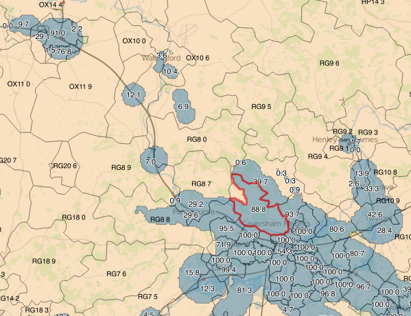

# Mapumental Postcode Sector Calculator

## What is this?

Let's say you have a list of places and you want to know what
postcode sectors can reach each place within 45 & 90 minutes by 08:30.

Not only that, but you want to know what *percentage* of the area of each
postcode sector can reach each place.

The output of the script is a CSV with the following columns:

 * Place ID
 * Postcode sector
 * Percentage of the postcode sector from where the place can be reached in 45m
 * Percentage of the postcode sector from where the place can be reached in 90m

There will be multiple lines per place, one for each postcode sector that the place can be reached from.

## How do I use it?

Prerequisites:

 * A CSV file with the places you want to calculate travel times to with the columns:
   * id, postcode, latitude, longitude
 * A Python virtualenv with the contents of requirements.txt
 * PostgreSQL with PostGIS.
 * Postcode sectors shapefile (e.g. from http://www.opendoorlogistics.com/data/)

### 1. Convert CSV to JSON

The scripts all operate on a single JSON file, `places.json`, and update
the contents of this file as part of their processing.

To get started, we need to create this file from the CSV. Assuming the CSV
is `data.csv` in the root of your working copy:

    $ ./bin/convert_csv.py data.csv

This will create `places.json`.

### 2. Set up the webhook

The `call_api.py` script from step 3 passes a URL as the callback param
to the API, so we need to make sure this URL will exist and does the right
thing.

Copy `bin/webhook.cgi` onto a server that'll allow it to be executed as a CGI
script, and set it up according to the instructions at the top of the file.

This might be as simple as putting it in your `public_html` if Apache is
configured to allow such things.

### 3. Call the API

The next step is to make an API call for each record in `places.json`. That's
what `bin/call_api.py` does.

This script requires two environment variables:

 * `MAPUMENTAL_API_KEY`: Your API key, from https://mapumental.com/account/
 * `MAPUMENTAL_API_CALLBACK`: The callback parameter to pass to the API. This will probably be the URL of the `webhook.cgi` script you set up in step 2, but can be your email address if you're happy to download each raster file manually.

The script will assign a `map_id` to each record in `places.json` so it knows
which record the resulting data files are associated with.

Run the script:

    $ ./bin/call_api.py

All the requests should be fired off to the API successfully. If not, you can
re-run the script without penalty because records that already have a `map_id`
assigned won't be sent to the API again.

You might want to get a cup of tea while the maps are processing.

### 4. Assign URLs to records

`~/postcode_intersections/urls.txt` (on the server where the webhook is running) will start
filling up with URLs for each successful API request. We need to assign each
record in `places.json` a URL where the raster data can be downloaded from, so
copy `urls.txt` from the server and then:

    $ ./bin/add_urls.py urls.txt

This will associate each URL in the `urls.txt` file with the correct record
in `places.json`, for requests that have finished. You can run this command
periodically with updated `urls.txt` from the webhook server.

The number of requests that haven't yet finished is printed at the end of
`add_urls.py`'s output. If all requests have completed and all records have a
URL, proceed.

### 5. Download raster data

Once the URLs have been added to the JSON file we need to download the raster
files:

    $ ./bin/download_rasters.py

This downloads the `.arx` files to `rasters/`.

### 6. Convert rasters to shapefiles

Each rasted needs to be processed to create shapefiles with polygons covering
travel time for 45 and 90 minutes.

This is done by `make_shapefiles.py`:

    $ ./bin/make_shapefiles.py rasters/*.arx

Shapefiles are output to `shapefiles/`. There's a TIFF image file to accompany
each shapefile which you can use to sanity check the bounds of the maps.

If the white area of any TIFF reaches the edge of the image then the entire
travel time hasn't been included and it'll need to be regenerated with wider
bounds. This shouldn't happen, but if it does you'll need to:

 * Remove the `map_id`, `url`, `raster_file` keys from the offending records in `places.json`
 * Increase the `speed` parameter in `bounds_for_record` in `call_api.py`
 * Re-run steps 3 onwards.

If all the TIFFs look good you can delete them to reclaim a bit of disk space;
they're no longer needed.

### 7. Import shapefiles into PostGIS

Next we need to load all the shapefiles into PostGIS so we can calculate
intersections between postcode sectors and travel time polygons.

Create a new PostGIS database, if you've not already done so:

    $ createdb postcode_intersections
    $ psql -d postcode_intersections -c 'CREATE EXTENSION postgis'

Load in the postcode sectors shapefile:

    $ shp2pgsql -d -s 4326 Sectors.shp public.sectors | psql postcode_intersections

Load the travel times shapefiles we generated from the rasters (this script assumes your database is called 'postcode_intersections', edit it to suit):

    $ ./bin/import_shapefiles.sh shapefiles/*shp

You can run some queries to check that everything's loaded as it should:

    $ psql -d postcode_intersections -c "SELECT COUNT(*) FROM sectors"
     count 
    -------
     10814
    (1 row)

    $ psql -d postcode_intersections -c "SELECT COUNT(*) FROM traveltimes"
     count 
    -------
      2007
    (1 row)

    $ psql -d postcode_intersections -c "SELECT COUNT(*) FROM traveltimes, sectors WHERE sectors.geom && traveltimes.geom"
     count 
    -------
     22817
    (1 row)

The counts don't have to exactly match the above, but should be relatively
close. The last query calculates the total number of intersections between
postcode sectors and travel time polygons and if it's zero despite the first
two queries returning non-zero figures there might be a problem with the SRIDs
of the imported shapefiles.

### 8. Generate final CSV

At this point all of the data is in place for the final output CSV to be
created.
This can be achieved with one command:

    $ ./bin/generate_output_csv.py

The file will be written to `output.csv`. The command takes a while to run,
during which most of the heavy lifting is done by the PostgreSQL server.

### 9. Exporting data as shapefiles

You can extract the data into a shapefile for further analysis in [QGIS](http://www.qgis.org/) or ArcGIS etc.

Let's say you want a shapefile showing sectors from where one particular place
can be reached within 90 minutes. You'll need to find the `map_id` value for
the place in `places.json`. Assuming the `map_id` is `84f1a794ebc1cf9ea9b285d19f1b7255fcd312fd`:

    $ pgsql2shp -f output.shp postcode_intersections "SELECT * FROM intersections where minutes = 90 and label = '84f1a794ebc1cf9ea9b285d19f1b7255fcd312fd'"

Depending on how many sectors can reach this place the command might take a few
minutes to run. When it does, you'll find a shapefile `output.shp` in the
current directory that you can load into your GIS tool.

Each polygon in the tool represents partial or total coverage of an individual
postcode sector. The attributes `sectorarea` and `interarea` tell you the area
of the postcode sector and the area covered by that feature respectively. The
units of the values are as output by PostGIS's `ST_Area` and are probably
meaningless by themselves, but you can calculate the percentage of a sector
covered by a feature using `(interarea / sectorarea) * 100`. Note that each
postcode sector might be covered by more than one polygon, so ensure you sum the `interarea` values for all features covering each postcode sector.
